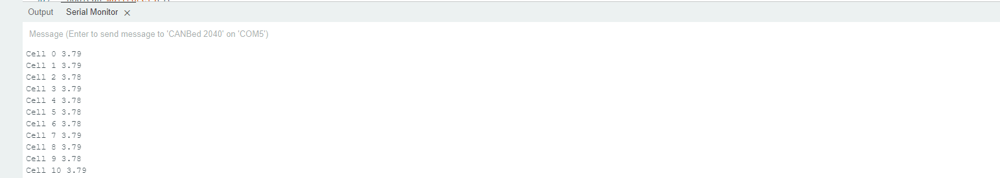

# Nissan Leaf  Can-Bus to Serial Decoder using RP2040 Processor  

Author: Matt MacLeod

Last Updated: 2023/03/07, working serial commands 

## Description

The following firmware is designed be a cheap interface enabling IoT edge devices to interpret the decoded can bus data from a Nissan Leaf BMS over serial. 

The goal of developing this interface was to allow developers an easy way to query the senors on the BMS so that they can be remotley monitored by issuing one of the following [commands](https://github.com/macleod-matt/nissan-leaf-can-bms/blob/testing-can/libraries/SensorTypes/SensorTypes.h#L81-L100)

The Serial commands for this interface was inteded to be a plug-in for an IoT sensing module compatible with the [Aretas Iot Cloud Suite](https://www2.aretas.ca/aretas-cloud/)

For simplity firmware was developed on the [Longan Labs Canbed 2040](https://docs.longan-labs.cc/1030018/) and the cloud persitance was done with a raspberry pi zero W. 


Notes:
- The middleware needs to read the serial output so a change was introduced to map debugging output to Serial1: 

```
HardwareSerial *serDebug = &Serial1;
HardwareSerial *serOutput = &Serial;
``` 
- If you do not have an FTDI adapter connected to Serial1 AND you need debugging output, change serDebug back to Serial. However, the middleware will probably not function correctly. 
- The sensor values have been decoded using the following document as a [reference](https://drive.google.com/file/d/1jH9cgm5v23qnqVnmZN3p4TvdaokWKPjM/view) 


## Requirments

1. CanBed 2040 board [available](https://www.mouser.ca/new/seeed-studio/seeed-canbed-arduino-development-board/)
2. raspberry pi zero w 
3. Aretas [Can bus Middleware](https://github.com/ElDuderino/CANBusMiddleware)
4. Nissan Leaf 
5. USB C Cable 
6. Arduino IDE 

## Deployment Raspberry Pi
In the home directory of the Rapsberry pi Zero W Enter the following commands:  

```
cd ~

git clone https://github.com/macleod-matt/nissan-leaf-can-bms.git

cd nissan-leaf-can-bms

bash arduino-cli-setup.sh

make 
```
view output on console 

**Note: You may get the following error: "arduino-cli: command not found"** 

If thats the case, type sudo reboot and re-enter try running the setup script again.  
## Deployment Aretas  

**After Following Above steps for Deployment on Raspberry pi** 
1. Clone aretas CANBusMiddleweare repo 
2. Navigate to Aretas Middleware  repo: cd CANBusMiddleware
3. configure .cfg file with credentials (see repo)
4. run ```python backend_daemon.py```
5. View data percisted into cloud database 


## Development

### **Firmware** 

1. clone repo 
2. open sketch in arduino IDE 
3. File->Preferences. Change sketch location to the location of the cloned repo  
4. Follow the Longan Labs instructions for setting up the board to a can bus devuice
5. Upload Sketch to the canbed board 
6. Connect the  CAN_H, CAN_L lines of the BMS to the canbed board 
7. Open a seral port monitor (either through the Arduino IDE or a third party program like teraterm)
8. Enter a [command](https://github.com/macleod-matt/nissan-leaf-can-bms/blob/testing-can/libraries/SensorTypes/SensorTypes.h#L81-L100) to querry one of the sensors: 

    e.g Entering "519"into the serial port allows us to querry the cell voltages: 
    
    e.g Entering "520"into the serial port allows us to querry the temperatures: 
        


A framework for a raspberry pi has been developed around this to interface with the Aretas IoT Cloud Ecosystem using a raspberry pi zero w as an edge device [see link to middleware](https://github.com/ElDuderino/CANBusMiddleware)

## Testing

The firmware was developed on a 2011 nissan Leaf Battery Pack. There may be unknown differences between that model and yours. So use at your own risk.   

The firmware has a few tests cases that allow the developer to extract the sensor data from the BMS without the need to manually input the serial commands by changing the following macros in [CanBusTesting.h](https://drive.google.com/file/d/1jH9cgm5v23qnqVnmZN3p4TvdaokWKPjM/view):


